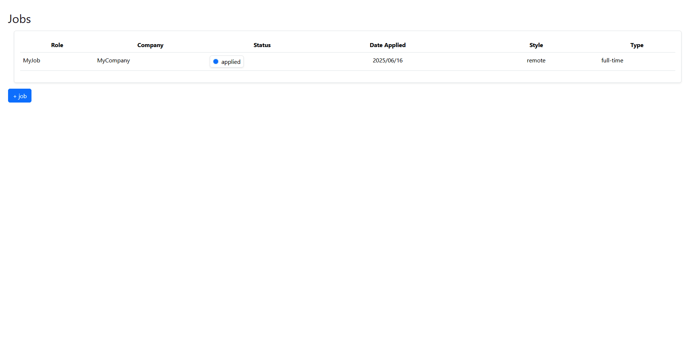
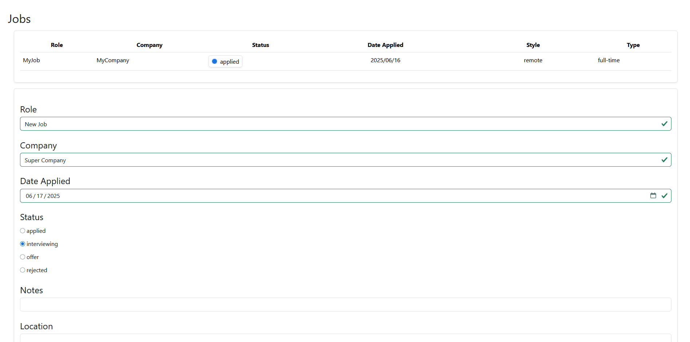
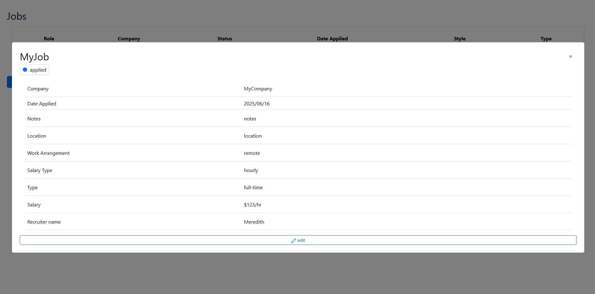

# JobTracker

Welcome to my Job Tracker!

Inspired by my own struggles at keeping my job applications organized, I decided to create my own job tracker.

**[View my progress](https://msabigails.github.io/projects/Job-Application-Tracker/buildlog)**

Inspiration:
Spreadsheets and note-based apps couldn't give me the flexibility I needed to effectively keep track of my job applications, so I decided to make my own job tracker.

This project utilizes:
* TypeScript
* MongoDB with Mongoose
* Vite + Vue + Bootstrap
* axios

Currently it is possible to:
* create records
* edit records
* expand records
* delete records
* create custom fields
* edit custom fields

Updating existing custom field on job application:

Adding custom field to new job application:

Creating custom field on existing job application:
